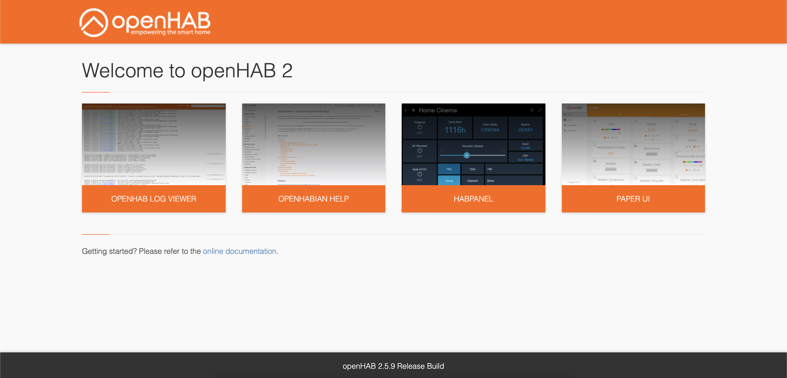
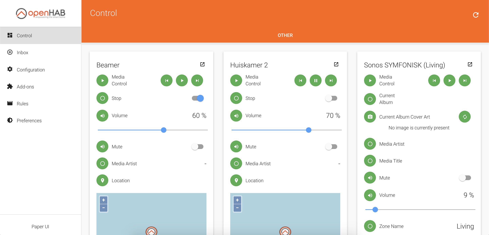
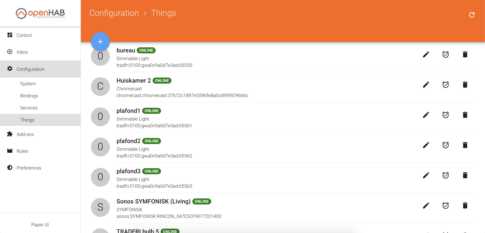
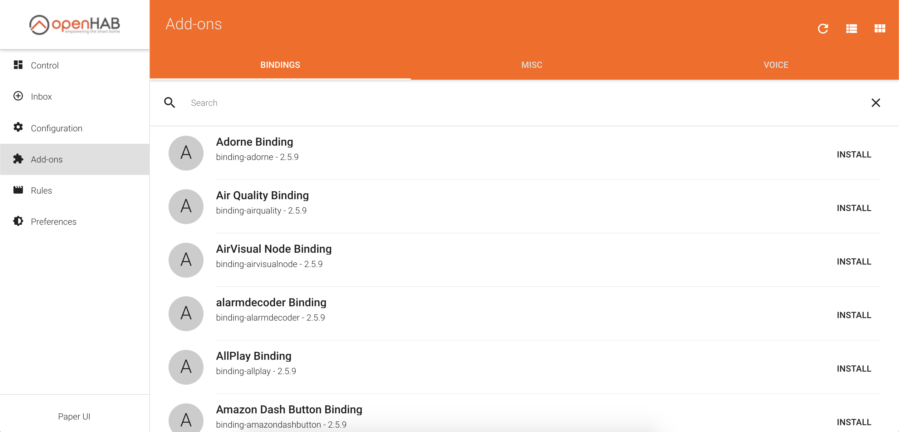
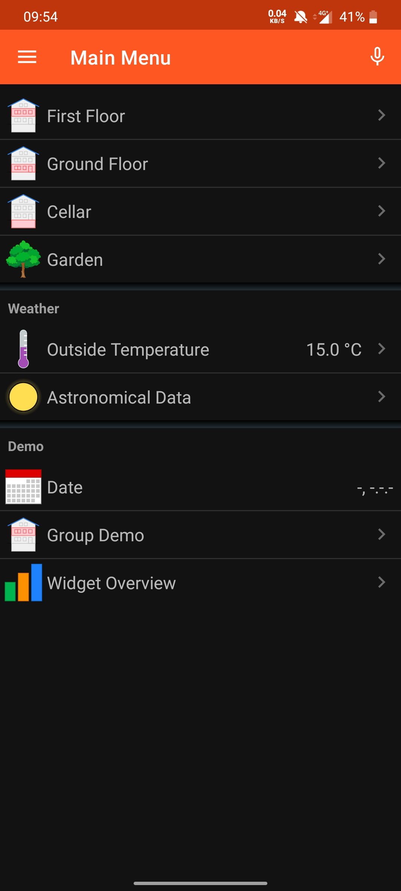
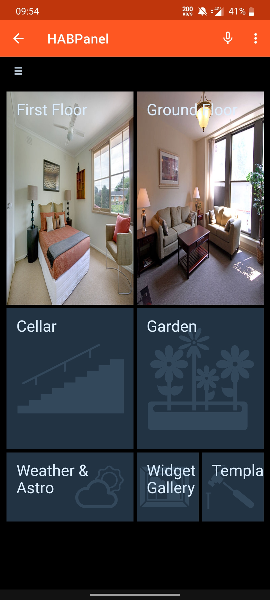
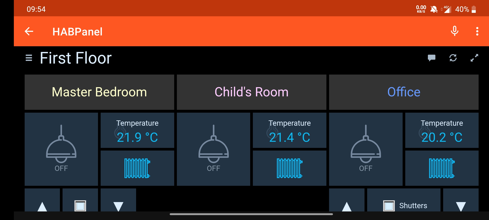

# Client

## Webclient
Na het installeren van de server kan je via je browser verbinden met de webclient. Dit doe je door de surfen naar het ip-adres van je pi gevolgd door poortnummer 8080. 

Wanneer je naarde Client surft kan je kiezen op welke manier je wilt interageren met de server.

* OpenHAB Log Vierwer: logs bekijken van de server
* Openhabian HELP: documentatie over je Openhabian installatie
* Habanel: custom panel voor het besturen van je smarthome
* Paper UI: standaard UI voor het configureren van je server. 

### Paper UI

Via het dashboard heb je volledige controle over je apparaten.

Via de configuratie kan je al je 'Things' bekijken en bewerken. 

Via Add-ons ka je bindings downloaden om je 'things' te besturen.

## Android App

Er bestaat een Android en IOS applicatie om je apparaten te besturen. 

