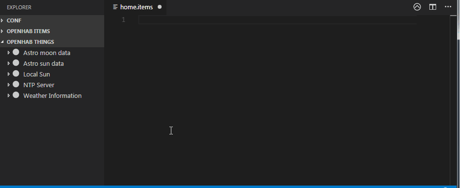
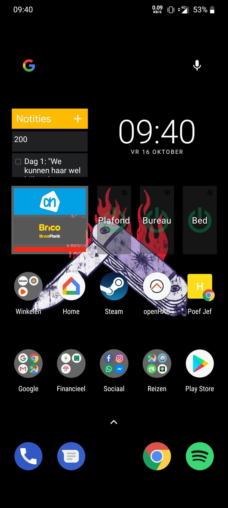

# Configuratie
Na installatie van de server op je raspberri kies je best voor demo installatie. Op deze manier start je met dummy data waarop je de configuratie van je eigen systeem kan baseren. 


In OpenHAB zijn er twee manieren om aan de slag te gaan voor het configureren van je systeem. Je kan gebruik maken van de UI of je kan zelf de configuratie files aanpassen. Als je kiest voor het laatste kan je gebruik maken van de extensie van Visual Studio Code. Hiermee maak je verbinding met je OpenHAB server en worden al je things en items automatisch gedetecteerd. 




## Configuratie

In je addon.cfg file kan je addons toevoegen. Als je op deze manier je addons gaat installeren, kan je ze niet meer toevoegen via de UI want die worden telkens verwijdert wanneer je de server herstart. 

 ``` Java
// A comma-separated list of bindings to install (e.g. "binding = sonos,knx,zwave")
binding = tradfri , sonos , amazonechocontrol , chromecast , buienradar
 ```

Na het toevoegen van een nieuwe binding gaat openHAB automatisch op zoek naar things die op je netwerk zitten en die je kan toevoegen aan je systeem. Het toevoegen kan je doen via  paperUI of via de configuratie files. Na het toevoegen van een thing kan je in de paperUI de channels hiervan aanpassen. 

In de configuratie van je systeem kan je de optie simple mode bij item linking uitschakelen. Hierdoor gaat openHAB de standaard items van een thing niet linken aan zijn channels. Vervolgens kan je je eigen items aanmaken en linken aan een channel. 


## Items
In de configuratie files kan je als volgt items toevoegen. Met een item kan je de channels van things op verschillende manieren manipuleren.

``` Java
Switch Desk_light_switch  "Lichten bureau schakelaar"  <switch>  (gR, Lights)  ["bureau_kamer"]
Dimmer Desk_light_dimmer  "Lichten bureau dimmer"  <lightbulb>  (gR)  ["bureau_kamer"]
```
In het voorbeeld hierboven zijn er twee items aangemaakt met volgende velden:
* Item type Switch
* Item name Desk_light_switch
* Item label Lichten bureau schakelaar
* Item icon switch
* Item groups gR en Lights
* Item taggs bureau_kamer

## Groups

Een group kan je gebruiken om meerdere things van hetzefde type aan te sturen of te categoriseren. Met de onderste lijn code kan je een groep van het type switch aanmaken om zo verschillende lichten met een knop aan en uit te zetten. 
``` Java
Group gLR           "Living"        <living>        ["living"]
Group gR            "Kamer"         <kamer>         ["kamer"]

Group:Switch:OR(ON, OFF)        Lights      "All Lights [(%d)]"
```

## Sitemap
De sitemap wordt gebruikt om je dashboard te configureren naar wens. 
Hier kan je verschillende onderdelen in aanmaken die Items kunnen aansturen die je gelinkt hebt aan de channels van je things. 
``` Java
sitemap demo label="Gustaaf Callierlaan"
{
	Frame {
		Text item=gLR icon="groundfloor" {
			Frame label="Sonos" {
				Slider item=Sonos_volume_dimmer label="Volume"
				Switch item=Sonos_toggle_mute label="Mute"
				Default item=Sonos_player
				Text item=sonos_SYMFONISK_RINCON_347E5CF9077201400_currenttitle label="Nummer" icon="none"
				Text item=sonos_SYMFONISK_RINCON_347E5CF9077201400_currentartist label="Artiest" icon="none"
				Text item=sonos_SYMFONISK_RINCON_347E5CF9077201400_currentalbum label="Album" icon="none"
			}
			Frame label="Beamer" {
				Slider item=Beamer_volume_dimmer label="Volume"
				Switch item=Beamer_toggle_mute label="Mute"
				Default item=Beamer_player

			}
		}
		Text item=gR icon="bedroom" {
			Frame label="Alle lichten" {
				Switch item=Lights label="Alle lichten" mappings=[ON="On", OFF='Off']
			}
			Frame label="Bureau"{
				Switch item=Desk_light_switch label="Bureau schakelaar"
				Slider item=Desk_light_dimmer label="Bureau dimmer"
			}
			Frame label="Bed"{
				Switch item=Bed_light_switch label="Bed schakelaar"
				Slider item=Bed_light_dimmer label="Bed dimmer"
			}
			Frame label="Plafond"{
				Switch item=Ceiling_light_switch label="Plafond schakelaar"
				Slider item=Ceiling_light_dimmer label="Plafond dimmer"
				Text label="Lichten plafond" icon="lightbulb" {
					Slider item=Ceiling_light1_dimmer label="Plafond center dimmer"
					Slider item=Ceiling_light2_dimmer label="Plafond bureau dimmer"
					Slider item=Ceiling_light3_dimmer label="Plafond bed dimmer"
				}
			}
		}
	}
}
```

## Dashboard


<iframe width="100%" height="500" src="https://www.youtube.com/embed/kdhdATxThNA" frameborder="0" allow="accelerometer; autoplay; clipboard-write; encrypted-media; gyroscope; picture-in-picture" allowfullscreen></iframe>


