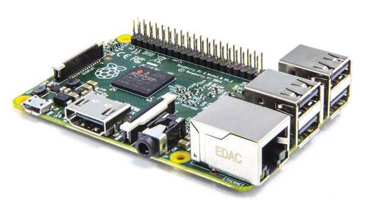

# Installatie

OpenHAB is volledig geschreven in Java waardoor het werkt op eender welk systeem dat een Java Virtual Machine kan draaien.
Je kan er voor kiezen op OpenHAB op je Mac of Windows PC en het enkel opstart wanneer je het nodig hebt.  
Een andere mogelijkheid is dat je OpenHAB isntalleert op een systeem dat 24/7 draait (zoals een raspberry). Hierdoor heb je permanent toegang tot je installatie.

## Installatie op de Raspberry PI

De Raspberry beidt veel voordelen voor het gebruik van OpenHAB. Het is een energie efficient systeem en de instap kost is uiteraard heel laag.

De minimum vereisten bij het gebruik van een Raspberry PI zijn:
* Een raspberry PI 2 of nieuwer
* SD kaart met minstens 16gb opslagcapaciteit
* Stabiele stroomtoevoer
* Ethernet verbinding
* *Scherm en toetsenbord zijn niet vereist!*

Er bestaan twee mogelijkheden om OpenHAB te installeren op een Raspberry PI:
* Via een custom versie van Raspbian ontwikkeld door OpenHAB: openhabian. 
* Manuele setup bovenop Raspbian via package manager.

