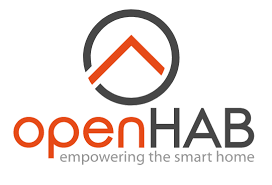
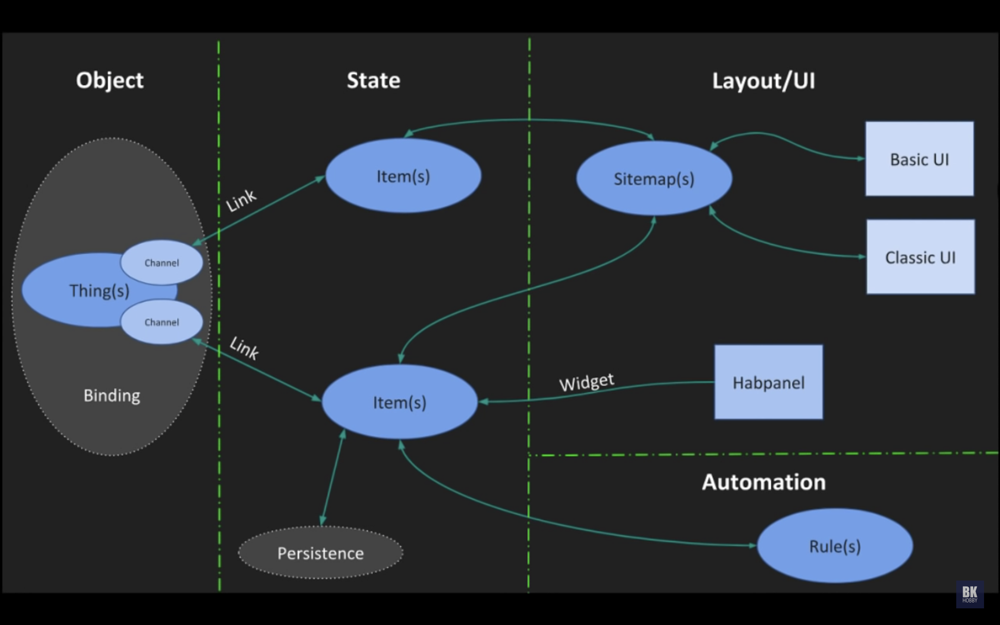

# OpenHAB

Open Home Automation Bus is een software ontwikkeld in Java om verschillende componenten voor automatisering van verschillende fabrikanten in één platform te verbinden. 

Het is in 2010 ontwikkeld door Kai Kreuzer. Sinds 2013 maakt het deel uit van het Eckipse project. Eclipse smarthome en OpenHAB worden parallel ontwikkeld. 

## Werking

Een openHAB project is opgedeeld in twee delen:
* De openHAB-runtime: het serverproces dat de acties uitvoert.
* De openHAB-designer: gebruiksvriendelijke configuratie-interface op basis van Eclipse. 

## Interfaces
Er zijn verschillende interfaces beschikbaar om openHAB te bedienen:
* Classic UI – klassieke Webinterface
* Apple iOS Client
* Android Client – HABDroid is een Open Source Android User Interface voor openHAB
* Windows 10 Client

Afhankelijk van de gebruikte interfaces kan er gebruik gemaakt worden van stembesturing, NFC communicatie of andere protocollen. 

## Werking

OpenHAB is opgebouwd uit verschillende onderdelen.

### Object

#### Thing
Het kleinste en simpelste onderdeel van een openHAB systeem is een "Thing". Dit kan een licht zijn, een sensor, tot de maan of de zon. 

#### Channel
Elke thing moet een Channel hebben. Een channel bedient een deel van een thing. Bij het voorbeeld van het licht is er bijvoorbeeld een channel voor de kleur en een channel voor de lichttemperatuur. 

#### Binding
Om een channel te kunnen bedienen moet je een binding installeren. Een binding is een add-on voor openHAB. Een binding kan op verschillende manieren geïnstalleerd worden: via de UI of via de configuration files. 

### State

#### Item
Een item is een virtuele voorstelling van de state van een object. Bijvoorbeeld de kleur van het licht of hij aan staat of niet. Een item kan net als bij een programmeer taal bestaat uit verschillende types: string, datetime, dimmer... 

Met behulp van items kan je things gaan groeperen om zo verschillende things te gaan besturen. Je kan bijvoorbeeld drie lampen met een dimmer in een groep steken en zo alle drie de lampen simultaan dimmen of helderder maken. 
